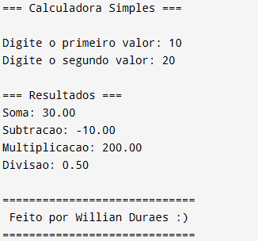

# 🧮 Calculadora Simples em C

Este projeto é uma **calculadora simples** desenvolvida em linguagem **C**, criada por **Willian Durães** 💻.  
O programa realiza operações matemáticas básicas entre **dois valores** informados pelo usuário.

---

## 🚀 Funcionalidades

O programa executa as seguintes operações:

- ➕ **Soma**  
- ➖ **Subtração**  
- ✖️ **Multiplicação**  
- ➗ **Divisão** (com verificação de divisão por zero)

---

## 🧠 Como funciona

1. O usuário é solicitado a digitar dois números.  
2. O programa calcula e exibe:
   - Soma  
   - Subtração  
   - Multiplicação  
   - Divisão (se o segundo número for diferente de zero)  
3. Exibe uma mensagem de crédito no final. 😄  

---

## 💻 Exemplo de uso

### 🔢 Entrada:
```
Digite o primeiro valor: 10
Digite o segundo valor: 5
```

### 📊 Saída:
```
=== Calculadora Simples ===

Digite o primeiro valor: 10
Digite o segundo valor: 5

=== Resultados ===
Soma: 15.00
Subtracao: 5.00
Multiplicacao: 50.00
Divisao: 2.00

=============================
 Feito por Willian Duraes :)
=============================
```

---

## 🖼️ Imagem do programa em execução



---

## 🛠️ Como compilar e executar

### 🧩 Compilando o programa:
```bash
gcc calculadora.c -o calculadora
```

### ▶️ Executando:
```bash
./calculadora
```

---

## 💡 Possíveis melhorias

Aqui vão algumas ideias para evoluir o projeto:

1. 🧾 **Adicionar menu de opções** (para escolher a operação antes de digitar os números).  
2. 🔁 **Permitir múltiplos cálculos** sem precisar reiniciar o programa.  
3. 🧮 **Usar funções separadas** para cada operação (soma, subtração, etc.).  
4. 🎨 **Adicionar cores** no terminal (usando códigos ANSI).  
5. 💾 **Salvar resultados** em um arquivo `.txt` para histórico.


---

## 👨🏻‍💻 Autor

 **Willian Durães**  
📍 Rio de Janeiro – Brasil  
💬 “Até no código dá pra ter fé!” ✝️  

---

✨ *Projeto simples, mas feito com dedicação!* ✨
